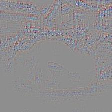
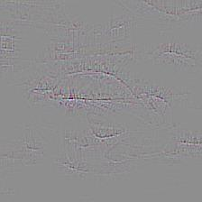
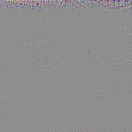
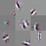

Visualizing and Understanding Convolutional Networks 
====================================================

This repository is the reproduction of paper [Visualizing and Understanding Convolutional Networks][]
by Matthew D. Zeiler and Rob Fergus.

[Visualizing and Understanding Convolutional Networks]: https://arxiv.org/abs/1311.2901

Implementation is done using Keras with Tensorflow background. This is only the
implementation of Visualization of features in CNN. This doesn't include occlusion
sensitivity experiment.

All the inversion functions (deconvolution, deactivation etc.) are implemented in visualize_cnn.py file. main.py is the driver file. All the remaining files are just helper modules(logging and keras functions). 

To test with a custom image or feature, following variables in the main.py file needs to be changed accordingly.

        TEST_IMAGE_PATH (path to image)

        VISUALIZE_LAYER (name of the layer)

        VISUALIZE_FEATURE (feature number)

        VISUALIZE_MODE ('all' or 'max')

## Sample Results:

### Original Image:

### Visualizations:

Following are the visualizations of 70, 127, 200 features in *block3_conv3* layer respectively:

  

Following are the visualizations that activated different features in *block2_conv2* layer:

